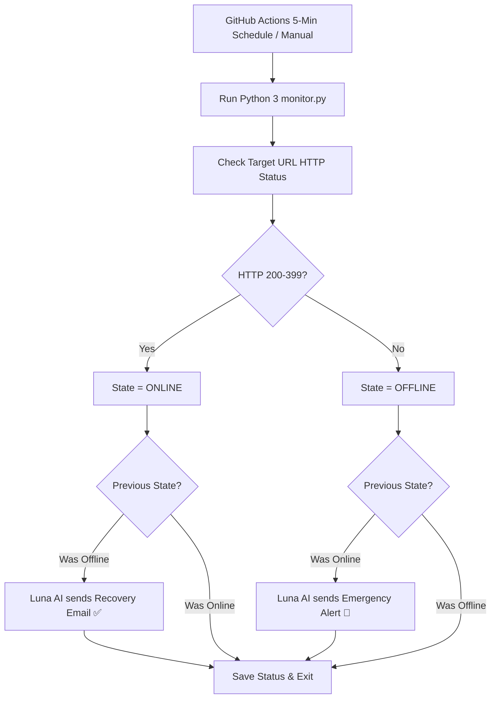

# 🌙 Luna AI — ARC-SERVER Website Uptime Monitor

A lightweight, 24/7 automated website uptime monitoring tool powered by **GitHub Actions**, **Python 3**, and **Gmail SMTP**. Features **Luna AI (ARC-SERVER Core)** persona with custom HTML email notifications and embedded avatars.

---

## 📸 ARC-SERVER Avatars

| Online & Healthy ✅ | Critical Alert / Down ❌ |
|:---:|:---:|
|  |  |

---

## ⚡ Features

- ⏱️ **24/7 Cloud Automated Monitoring**: Runs every 5 minutes in GitHub Cloud — **works even when your laptop is turned OFF**.
- 🌙 **Luna AI Persona**: Custom email alerts ("Good morning Boss! https://www.tn-mbamca.com is ONLINE ✨").
- 🎨 **HTML Email Templates**: Styled cyber-terminal layout with live embedded ARC-SERVER status avatars.
- 📧 **Smart State Alerts**: Only emails when your site goes **DOWN** or comes back **ONLINE** (prevents inbox spam).
- 💰 **100% Free**: Uses 0 paid services — operates entirely within free tier limits.

---

## 🛠️ How It Works

---

## 🚀 Setup & Secrets Guide

In your GitHub repository (**Settings ➔ Secrets and variables ➔ Actions ➔ New repository secret**), configure:

| Secret Name | Value | Description |
|---|---|---|
| `EMAIL_USERNAME` | `arunachalamthehacker@gmail.com` | Sender email address |
| `EMAIL_PASSWORD` | `vwtadphcrbrcaemo` | Gmail App Password |
| `EMAIL_TO` | `cutyarunachalam1@gmail.com` | Notification recipient email |

---

## 📄 License

MIT License. Free for personal and commercial use.
