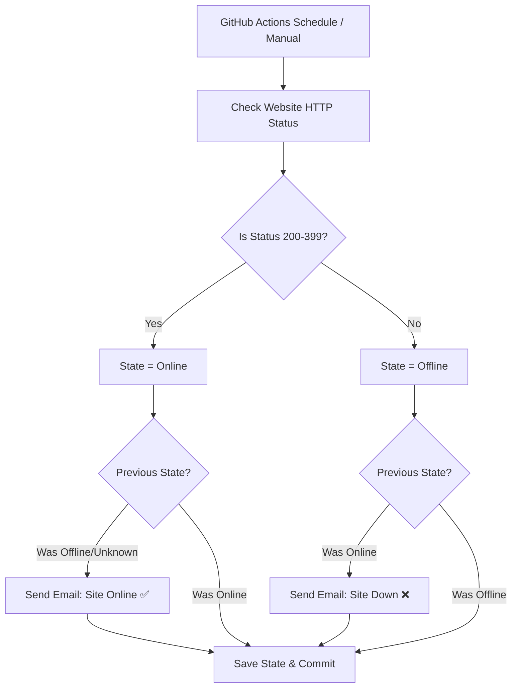

# 🌐 Website Uptime Monitor

A lightweight, automated website uptime monitoring tool powered by **GitHub Actions** and **Gmail SMTP**. It monitors website availability every 5 minutes and sends instant email alerts when your site goes down or recovers.

---

## ⚡ Features

- ⏱️ **Automated Checks**: Runs every 5 minutes via GitHub Actions cron schedule.
- 📧 **Instant Email Alerts**: Sends notifications when your site transitions from **Online ➔ Offline** or **Offline ➔ Online**.
- 🧠 **Smart State Persistence**: Tracks previous status in `status.txt` to avoid spamming your inbox on every check.
- 💰 **100% Free**: Operates entirely within GitHub Actions free tier — no external paid monitoring services required.
- 🛠️ **Manual Trigger Support**: Includes `workflow_dispatch` so you can manually trigger tests anytime from GitHub interface.

---

## 🛠️ How It Works



---

## 🚀 Setup Guide

### 1. Configure Repository Secrets
Go to your GitHub repository: **Settings ➔ Secrets and variables ➔ Actions ➔ New repository secret**.

Add the following three secrets:

| Secret Name | Value | Description |
|---|---|---|
| `EMAIL_USERNAME` | `arunachalamthehacker@gmail.com` | Your sender email address |
| `EMAIL_PASSWORD` | `<16-char-app-password>` | Gmail App Password (see below) |
| `EMAIL_TO` | `cutyarunachalam1@gmail.com` | Recipient email address for alerts |

> ⚠️ **Important**: Google blocks regular account passwords for SMTP access. You **must** generate a 16-character **Gmail App Password**.

#### How to get a Gmail App Password:
1. Enable **2-Step Verification** on your Google Account ([myaccount.google.com/security](https://myaccount.google.com/security)).
2. Go to **App Passwords** ([myaccount.google.com/apppasswords](https://myaccount.google.com/apppasswords)).
3. Generate an App Password for **Mail**.
4. Copy the generated 16-character code and paste it as the `EMAIL_PASSWORD` secret.

---

### 2. Enable Workflow Permissions
To allow GitHub Actions to commit state updates (`status.txt`):
1. Navigate to **Settings ➔ Actions ➔ General**.
2. Under **Workflow permissions**, select **Read and write permissions**.
3. Click **Save**.

---

### 3. Change Target Website
To monitor a different website, edit [.github/workflows/monitor.yml](.github/workflows/monitor.yml):

```yaml
URL="https://yourwebsite.com"
```

---

## 🧪 Testing

1. Go to your repository on GitHub.
2. Click the **Actions** tab.
3. Select **Website Uptime Monitor** from the left sidebar.
4. Click **Run workflow** ➔ **Run workflow**.

---

## 📄 License

MIT License. Free for personal and commercial use.
